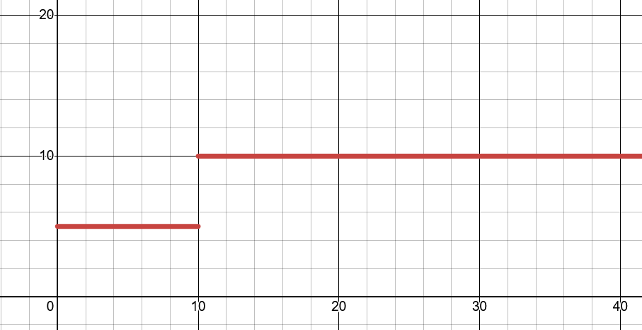
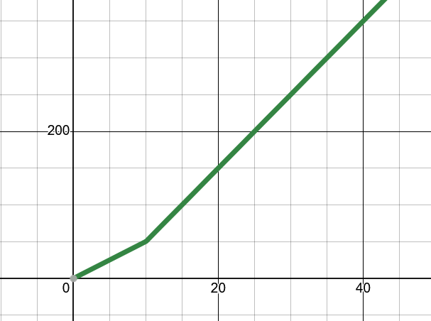

# Why are integrals and derivatives inverses of each other?

A fact that every student learning calculus will undoubtedly hear, helping to bridge the gap between the 2 branches of differentiation and integration. It contextualises every technique learnt. But why is it true? How do we visualise it outside of abstract proofs?

$$F(x) = \int_a^x{f(t)dt}$$

## Car Analogy

Perhaps the easiest explanation is one involving a somewhat ________ situation. Consider that you are driving along a highway, and would like to know how far you have travelled in a particular time period. For this situation, there are no street signs or navigation systems - only the dashboard in front of you.

So let's say every 10 seconds you look at your speed. In that 10 seconds, we can calculate how far you would have travelled:

$$
v = \frac{d}{\Delta t}\\\\
d = v\Delta t
$$

But that's only for ten seconds. We would need to sum up all the time intervals to get a total distance:

$$
d_{tot} = \sum v\Delta t 
$$

Great, now we have an estimate for the total distance. But this estimate isn't very good; it assumes our speed is constant within the 10 second intervals. But a lot can happen in that time; we can speed up to overtake, slow down for traffic, etc. So we should try to reduce the time interval as much as possible. We know that within calculus, this is modelled as a **limit**. Thus we could express our total distance as:

$$
d_{tot} = \lim\limits_{\Delta t\to 0} \sum v\Delta t 
$$

What we have is just integration from first principles. Thus we can replace it with:

$$
d_{tot} = \int v\ dt
$$

And therefore, distance is the integral of velocity with respect to time. We know that velocity is the derivative of distance with respect to time, so we have proven that indeed derivatives and integrals are inverses.

## A way to visualise it

We can flesh this out with a bit of visualisation. Imagine what would happen if you speed up by $5\ m/s$ instantaneously, from $5\ m/s$ to $10\ m/s$. The $v(t)$ graph would sharply increase. But your distance travelled would not sharply increase; rather, for every second after this change, your distance will increase by 10 m, rather than 5 m. In other words, the **slope** of the distance graph will increase. This makes sense as the *area under the curve* of the velocity graph does not sharply increase at this point; it just increases faster than it did before.

**Velocity**

**Distance**
